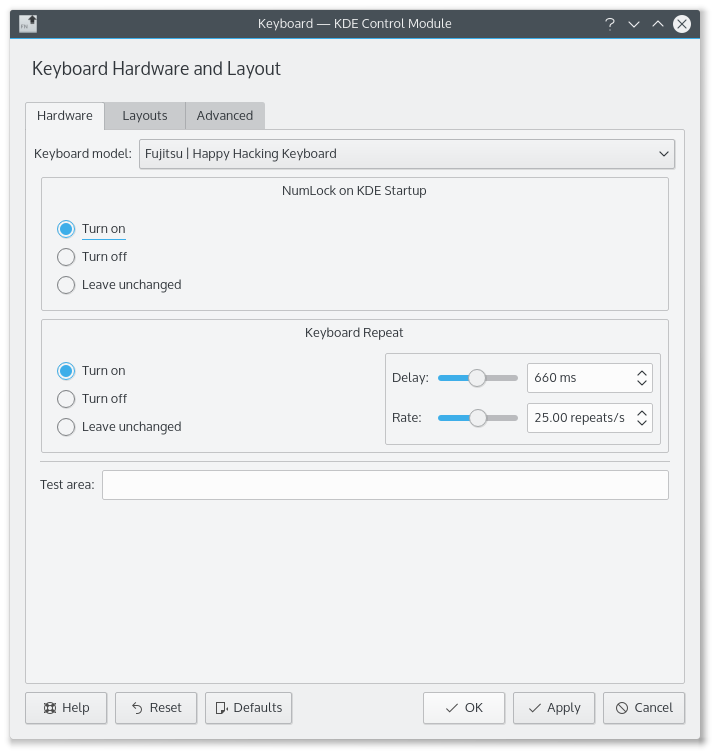
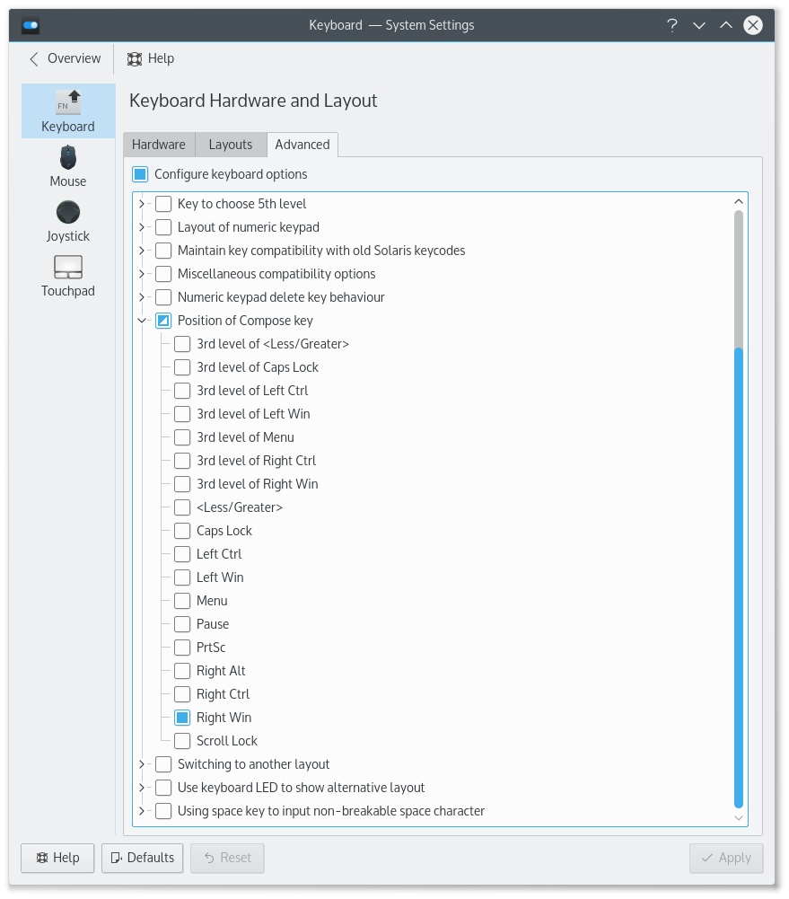
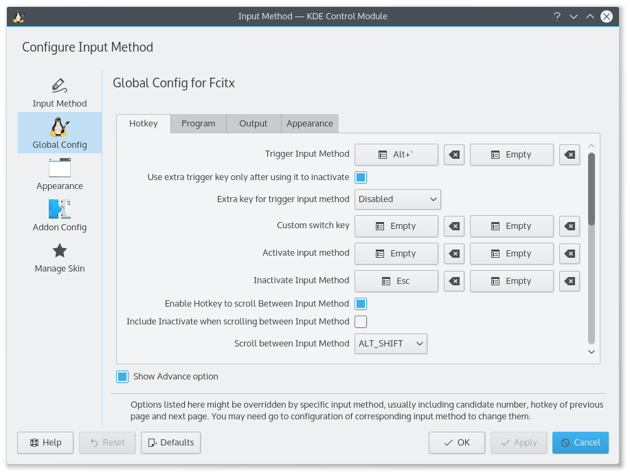
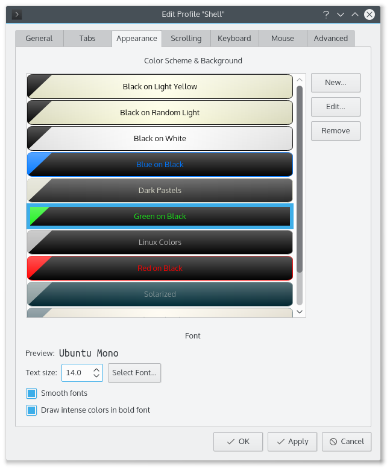
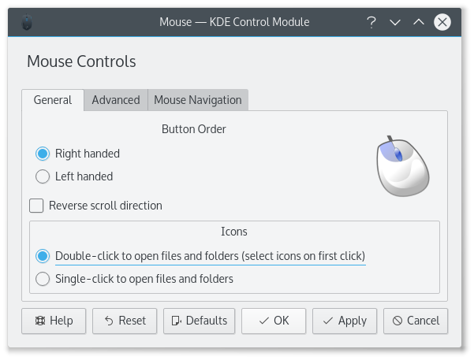

# Kubuntu 15.10 日本語環境・開発環境設定方法

#### 初期設定

```sh
sudo apt-get update
sudo apt-get upgrade
sudo do-release-upgrade -d
sudo apt-get install nvidia-340
reboot
sudo apt-get install fcitx fcitx-mozc kde-config-fcitx
im-config -n fcitx
echo 'export GTK_IM_MODULE=fcitx' >> ~/.profile
echo 'export QT_IM_MODULE=fcitx' >> ~/.profile
echo 'export XMODIFIERS="@im=fcitx"' >> ~/.profile
sudo apt-get install tmux git

# Google Chrome, Slack, Skype, Dropbox
sudo apt-get install sni-qt:i386

# Java
sudo add-apt-repository ppa:webupd8team/java
sudo apt-get update
sudo apt-get install oracle-java8-installer
sudo update-alternatives --config java

# Scala
echo "deb https://dl.bintray.com/sbt/debian /" | sudo tee -a /etc/apt/sources.list.d/sbt.list
sudo apt-key adv --keyserver hkp://keyserver.ubuntu.com:80 --recv 642AC823
sudo apt-get update
sudo apt-get install sbt

# TeXLive
sudo apt-get install texlive-full xzdec
tlmgr init-usertree
tlmgr update --self

# Haskell
sudo apt-key adv --keyserver keyserver.ubuntu.com --recv-keys 575159689BEFB442
echo 'deb http://download.fpcomplete.com/ubuntu wily main' | sudo tee /etc/apt/sources.list.d/fpco.list
sudo apt-get update
sudo apt-get install stack
```

#### Vim
Ansible ディレクトリ内参照

#### 起動時に NumLock On


#### Compose Key を有効にする


#### Alt + grave で IM を日本語に切り替える
Walk Through Windows of Current Application のショートカットキーを削除  


IM の設定で Trigger Input Method の項目を変更する。  


#### konsole で日本語に変換したとき、色の反転する範囲がおかしい
フォントを Ubuntu Mono にする。  


#### konsole で日本語のフォントの下の部分が見きれる
Line Spacing を 2 にする。  


#### シングルクリックでファイルが開かないようにする
Mouse 項目で設定する。Apply を忘れないように気をつける。  

